# 09-ci-03-cicd

## Подготовка к выполнению

### Виртуальные машины:


### Nexus:
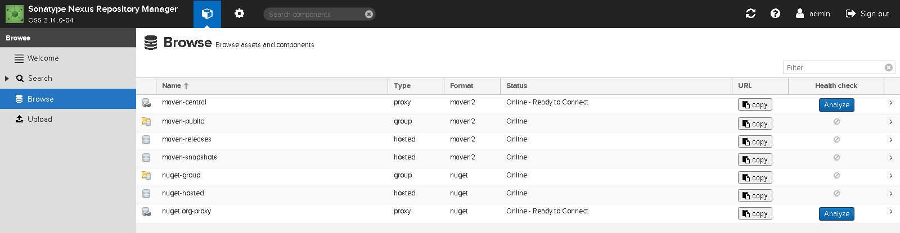

### SonarQube:
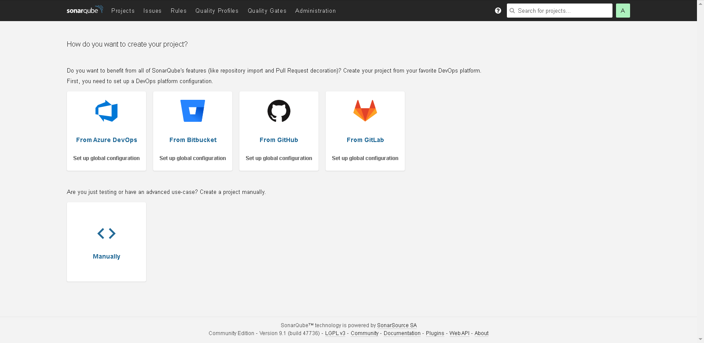

## Знакомоство с SonarQube

### Основная часть

``` bash
sonar-scanner --version
```
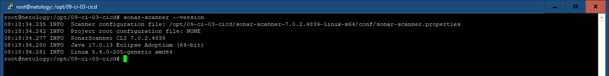

Тест кода ./example/fail.py:

``` bash
sonar-scanner -Dsonar.projectKey=tvm2360-example -Dsonar.sources=. -Dsonar.host.url=http://51.250.114.130:9000 -Dsonar.login=4a9151ce170ea3e57a704dd95a7161ae76d109ae -Dsonar.coverage.exclusions=fail.py
```

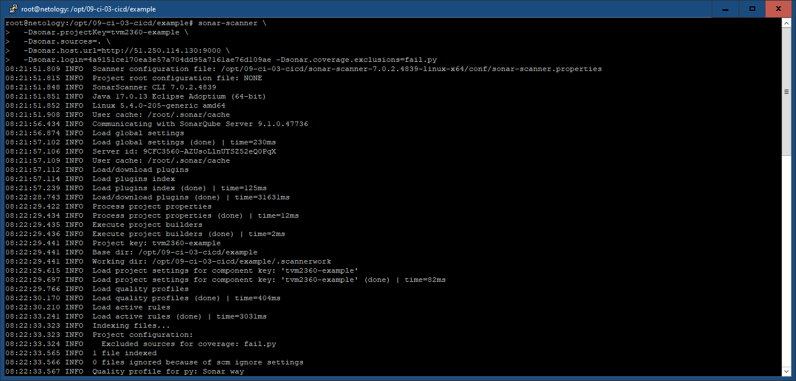

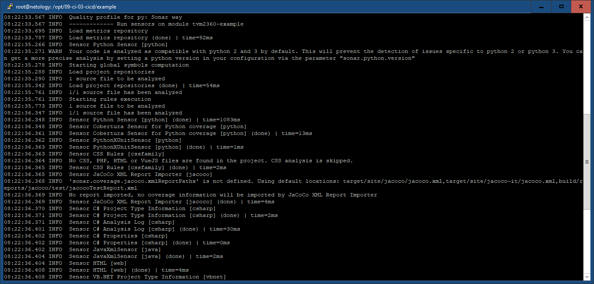

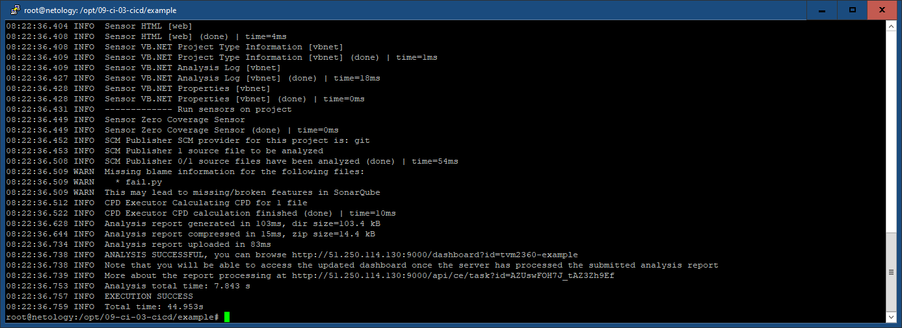

Результат:

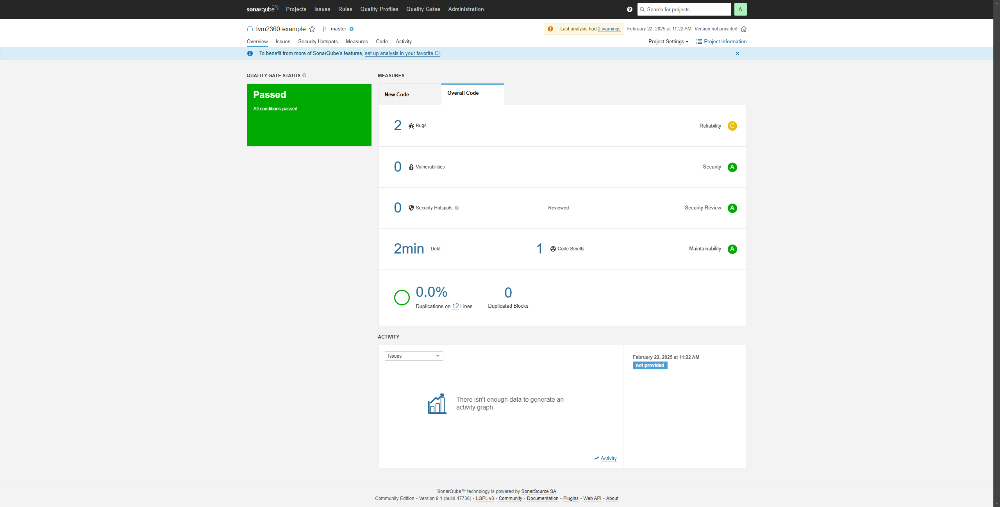

Bugs:

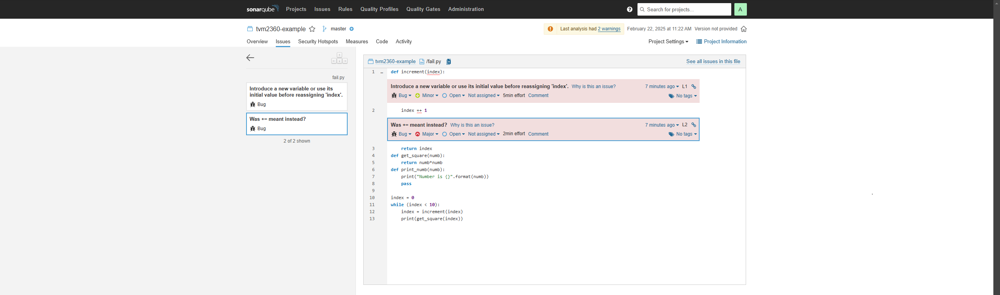

Code Smells:

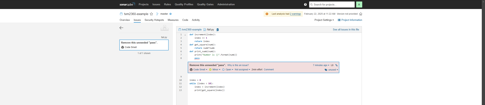

Результат повторного теста после исправления:

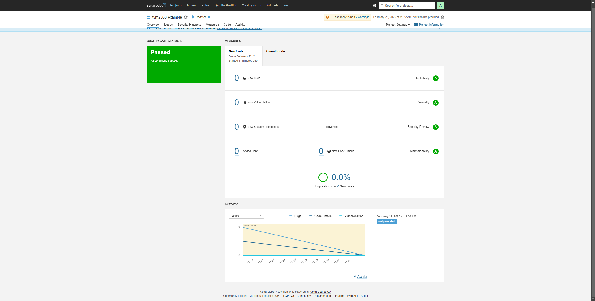

## Знакомство с Nexus

### Основная часть

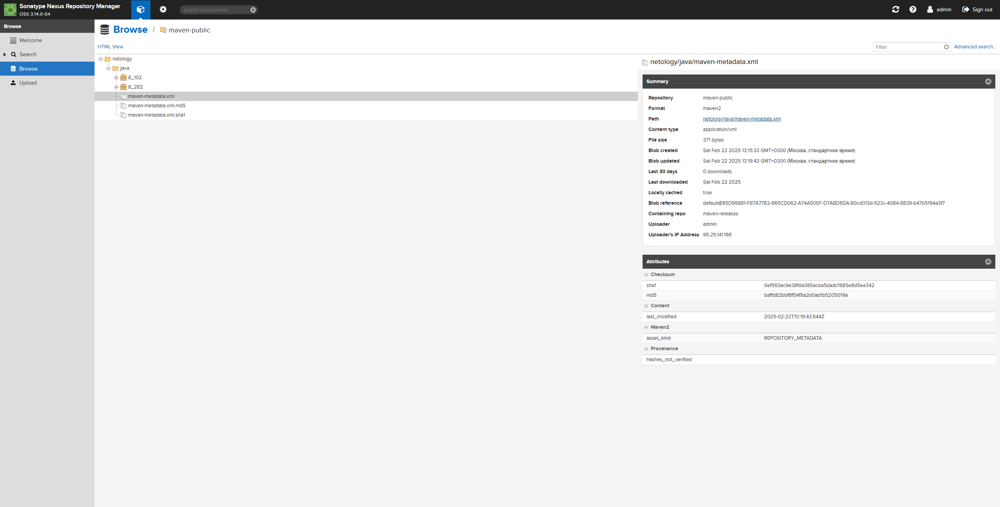

[maven-metadata.xml](./load/maven-metadata.xml):
``` xml
<?xml version="1.0" encoding="UTF-8"?>
<metadata modelVersion="1.1.0">
  <groupId>netology</groupId>
  <artifactId>java</artifactId>
  <versioning>
    <latest>8_282</latest>
    <release>8_282</release>
    <versions>
      <version>8_102</version>
      <version>8_282</version>
    </versions>
    <lastUpdated>20250222101943</lastUpdated>
  </versioning>
</metadata>
```

## Знакомство с Maven

### Подготовка к выполнению

``` bash
mvn --version
```
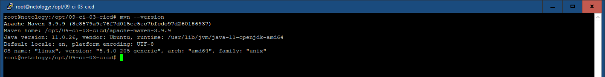

[pom.xml](./mvn/pom.xml):
``` xml
<project xmlns="http://maven.apache.org/POM/4.0.0" xmlns:xsi="http://www.w3.org/2001/XMLSchema-instance"
  xsi:schemaLocation="http://maven.apache.org/POM/4.0.0 http://maven.apache.org/xsd/maven-4.0.0.xsd">
  <modelVersion>4.0.0</modelVersion>
  <groupId>com.netology.app</groupId>
  <artifactId>simple-app</artifactId>
  <version>1.0-SNAPSHOT</version>
   <repositories>
    <repository>
      <id>my-repo</id>
      <name>maven-public</name>
      <url>http://51.250.115.172:8081/repository/maven-public/</url>
    </repository>
  </repositories>
  <dependencies>
    <dependency>
      <groupId>netology</groupId>
      <artifactId>java</artifactId>
      <version>8_282</version>
      <classifier>distrib</classifier>
      <type>tar.gz</type>
    </dependency>
  </dependencies>
</project>
```

``` bash
mvn package
```
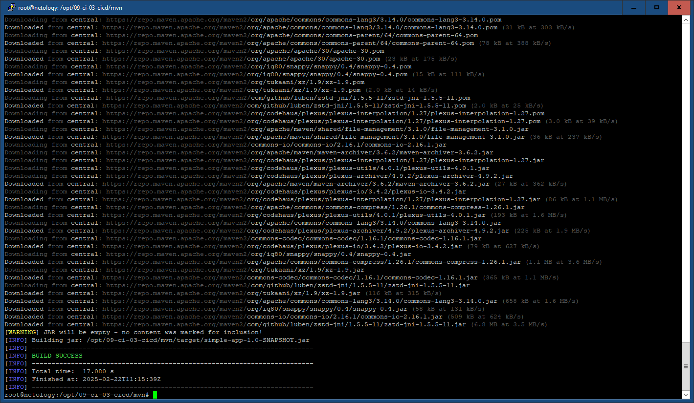

``` bash
ls -la ~/.m2/repository/netology/java/8_282
```
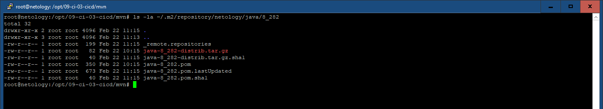


