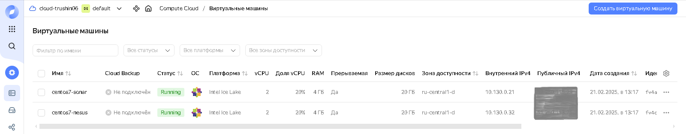

# 09-ci-03-cicd

## Подготовка к выполнению

### Виртуальные машины:


### Nexus:


### SonarQube:


## Знакомоство с SonarQube

### Основная часть

``` bash
sonar-scanner --version
```


Тест кода ./example/fail.py:

``` bash
sonar-scanner -Dsonar.projectKey=tvm2360-example -Dsonar.sources=. -Dsonar.host.url=http://51.250.114.130:9000 -Dsonar.login=4a9151ce170ea3e57a704dd95a7161ae76d109ae -Dsonar.coverage.exclusions=fail.py
```


Результат:


Bugs:


Code Smells:


Результат повторного теста после исправления:


